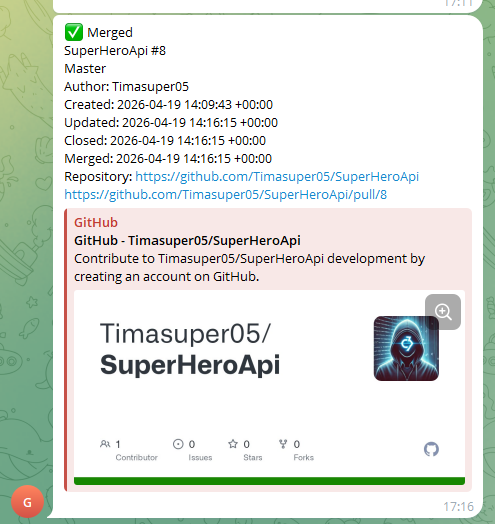

# GitHub Monitoring Bot

Небольшой .NET-бот, который периодически проверяет pull request'ы в настроенных GitHub-репозиториях и отправляет уведомления в Telegram при появлении новых PR или изменении их статуса.

## Что умеет

- запускается как фоновый `HostedService`;
- читает настройки из `appsettings.json`;
- подключается к GitHub через Personal Access Token (`GitPat`);
- отслеживает репозитории из `RepoList`;
- поддерживает явное указание владельца репозитория через `Owner`;
- если `Owner` не задан, ищет доступные текущему GitHub-аккаунту репозитории по имени;
- проверяет открытые PR и дополнительно обновляет статус уже отслеживаемых PR, которые были закрыты или смерджены;
- определяет статусы PR: `Open`, `Merged`, `Closed`;
- хранит состояние PR в SQLite-базе `github-monitoring.db`;
- автоматически применяет EF Core migrations при старте;
- отправляет Telegram-сообщение в обычный чат или в topic через `ThreadId`;
- добавляет к сообщению inline-кнопку для открытия pull request.

## Стек

- `.NET 10`
- `Microsoft.Extensions.Hosting`
- `Entity Framework Core + SQLite`
- `Octokit`
- `Telegram.Bot`
- `Mapster`
- `xUnit`

## Структура проекта

- `Program.cs` - регистрация DI, конфигурации, GitHub/Telegram-клиентов и запуск worker'а.
- `Extensions/` - extension-методы для регистрации настроек, клиентов, сервисов, маппинга и persistence-слоя.
- `Services/` - GitHub-запросы, мониторинг PR, worker и определение статуса PR.
- `Notifications/` - форматирование и отправка Telegram-уведомлений.
- `Data/` - `DbContext`, миграции и репозиторий записей PR.
- `Models/` - настройки, доменные модели и enum статусов.
- `Mapping/` - Mapster-конфигурация и маппер GitHub PR в запись базы.
- `tests/` - unit-тесты форматтера, маппера и resolver'а статуса.

## Конфигурация

Настройки лежат в `appsettings.json`.

```json
{
  "BotToken": "telegram-bot-token",
  "GitPat": "github-personal-access-token",
  "ChatId": "telegram-chat-id",
  "ThreadId": 2,
  "Interval": 10000,
  "RepoList": [
    {
      "Owner": "octocat",
      "RepoName": "SuperHeroApi"
    }
  ]
}
```

- `BotToken` - токен Telegram-бота.
- `GitPat` - GitHub Personal Access Token. Аккаунт токена должен иметь доступ к репозиториям из `RepoList`.
- `ChatId` - ID Telegram-чата, канала или группы.
- `ThreadId` - ID topic'а в forum-чате Telegram. Можно убрать или поставить `null`, если topic не нужен.
- `Interval` - пауза между проверками в миллисекундах.
- `RepoList[].Owner` - владелец репозитория: пользователь или организация. Рекомендуется указывать явно.
- `RepoList[].RepoName` - имя репозитория для отслеживания.

Если `Owner` не указан, бот получает список репозиториев, доступных текущему GitHub-аккаунту, и выбирает все репозитории с совпадающим `RepoName`. Это удобно для простого конфига, но при одноименных репозиториях у разных владельцев лучше указать `Owner`.

Не храните реальные `BotToken` и `GitPat` в публичном репозитории. Для локальной разработки можно использовать `appsettings.json`, а для продакшена лучше передавать секреты через переменные окружения или другой защищенный secret storage.

## Запуск

1. Установите .NET SDK с поддержкой `net10.0`.
2. Заполните `appsettings.json`.
3. Выполните команды из корня проекта:

```bash
dotnet restore
dotnet run
```

При первом запуске приложение создаст `github-monitoring.db` в рабочем каталоге и применит миграции. После этого worker будет проверять GitHub с интервалом из `Interval`.

## Тесты

```bash
dotnet test
```

## Формат уведомлений

Telegram-сообщение содержит:

- статус события: `New`, `Merged` или `Closed`;
- заголовок pull request;
- автора;
- дату события в московском времени;
- inline-кнопку `Открыть PR` со ссылкой на pull request.

Для новых PR используется дата создания, для merged PR - дата merge, для closed PR - дата закрытия. Если точная дата merge/close недоступна, используется `UpdatedAt`.


